# <center style="font-size:35"> OpenBK </center>

## 00 - Set Up Software

Pada part ini, kita akan melakukan setup atau persiapan dan pengaturan pada aplikasi text editor yang akan kita pakai kedepannya yaitu `VSCode`. 

Sebelum kita melakukan pengaturan pada text editor kita, ada beberapa aplikasi yang mesti kita install yaitu `VSCode`, `Git`, `Laragon`, `Composer`. 

Namun, sebelum kita melakukan instalasi, saya akan mengklarifikasi beberapa hal seperti,

- Kenapa kita perlu menginstall `Git` ? Alasannya adalah agar kita dapat menggunakan terminal yang dibawa oleh `Git` yaitu `Git Bash`. Mengapa menggunakan `Git Bash` ? Karena lebih mudah saja digunakan dan agar dapat menunjang penggunaan command yang akan ditunjukkan pada modul ini. Walaupun sebenarnya anda bisa saja menggunakan terminal atau command prompt favorit anda dan anda bisa sesuaikan saja sesuai dengan keinginan anda.

- Apakah harus menggunakan `Laragon` ? Sebenarnya sih tidak dan sah-sah saja bagi anda untuk menggunakan Development Server stack lain seperti `XAMPP`, `WAMP`, `EasyPHP`, dan sebagainya. Namun, karena saya lebih terbiasa menggunakan `Laragon` maka saya hanya menunjukkan bagaimana cara menginstall laragon dan mengkonfigurasinya.

### Instalasi software yang dibutuhkan <hr>

- #### VSCode<hr>

    1. Kunjungi halaman download [`VSCode`](https://code.visualstudio.com/Download) di https://code.visualstudio.com/Download .

    2. Lalu pilih yang Windows.

        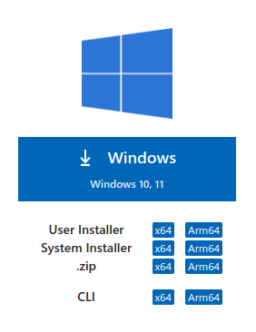<br>

    3. Setelah selesai proses downloadnya, kita bisa langsung saja menekan open file pada menu download pada browser kita

        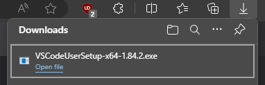<br>

        atau kita juga bisa membuka folder download pada file explorer kita lalu kita mengklik 2 kali filenya.

        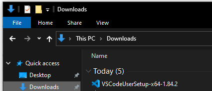<br>

    4. Setelah window instalasi muncul, kita mesti menyetujui lisensinya terlebih dahulu, lalu tekan next.

        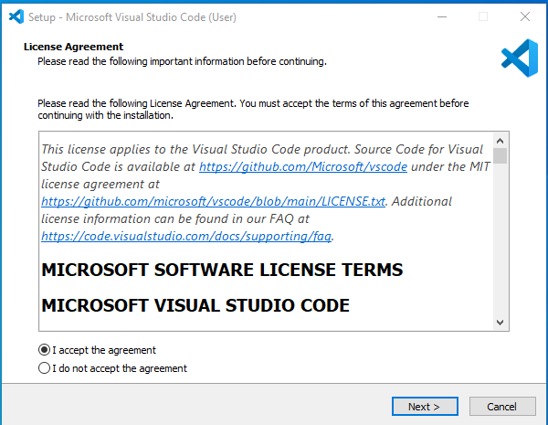<br>

    5. Bilamana sudah mencapai bagian "Select additional task", sangat disarankan untuk memilih atau mencentang semuanya untuk memudahkan kita dalam mengakses `VSCode` pada folder project kita, walaupun sebenarnya ini bisa saja disesuaikan dengan preferensi anda.

        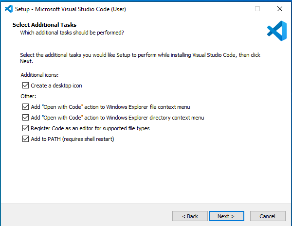<br>

    6. Lalu klik install dan tunggu sampai proses instalasi selesai.

        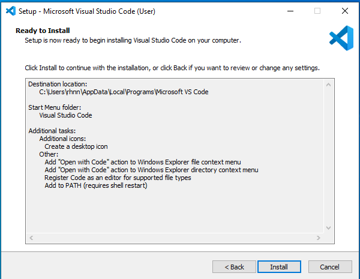<br>

    7. Setelah proses instalasi selesai, anda dapat melakukan uncheck pada bagian "Launch Visual Studio Code" karena kita akan membuka dan melakukan konfigurasinya nanti, lalu klik finish.

        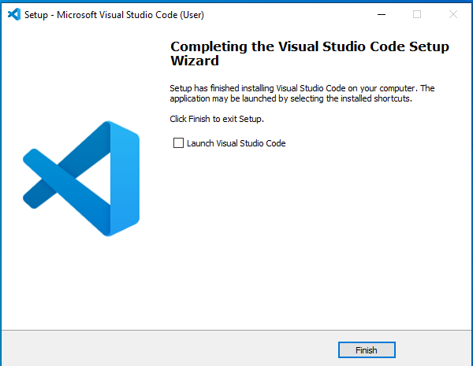<br>

- #### Git <hr>

    1. Kunjungi halaman download [`Git`](https://git-scm.com/downloads) di https://git-scm.com/downloads .

    2. Anda dapat langsung memilih yang "Download for Windows" pada bagian kanan, karena websitenya akan langsung mendetek OS apa yang anda gunakan, lalu klik pada "Click here to download". Jadi, jangan khawatir anda akan salah mendownload

        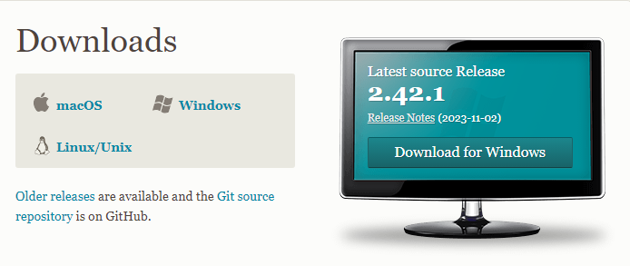<br>

        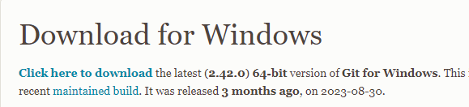<br>
        
        atau bila anda tidak yakin, anda dapat memilih sesuai dengan OS yang anda gunakan pada sebelah kiri lalu download yang sesuai dengan OS yang anda gunakan.

    3. Setelah proses download selesai, kita bisa langsung saja menekan "Open file" dari menu download pada browser kita

        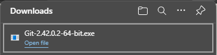<br>

        atau kita juga bisa membuka folder download pada file explorer kita lalu kita mengklik 2 kali filenya.

        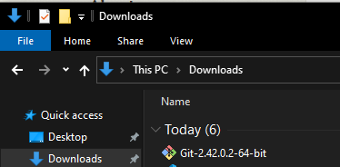<br>

    4. Setelah window instalasi muncul, kita dapat menekan next saja terus hingga proses instalasi berjalan. Setelahnya uncheck pada bagian "View Release Notes" lalu klik finish.

- #### Laragon <hr>

    1. Kunjugi laman download [`Laragon`](https://laragon.org/download/) di https://laragon.org/download/ .

    2. Lalu, pada bagian "Edition" anda bisa memilih yang full.

        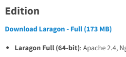<br>

    3. Setelah terdownload, kita bisa langsung menekan "Open file" pada menu download pada browser kita

        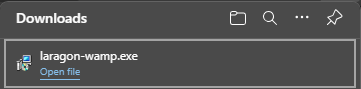<br>

        atau kita juga bisa membuka folder download pada file explorer kita lalu kita mengklik 2 kali filenya.

        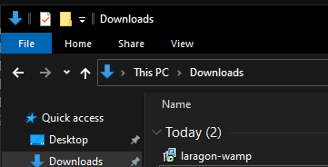<br>

    4. Setelah window instalasi muncul, kita dapat memilih bahasanya lalu klik Ok. Setelah itu tekan next, lalu pada bagian "Auto start, Auto detect and create virtual host" anda dapat uncheck pada bagian "Run Laragon when Windows start" agar laragon tidak berjalan secara otomatis pada saat perangkat baru dinyalakan. Setelahnya next saja sampai proses instalasi dimulai.

    5. Setelah instalasi selesai, uncheck pada bagian "Run Laragon" lalu klik finish.

- #### Composer <hr>

    1. Kunjungin halaman download [`Composer`](https://getcomposer.org/download/) di https://getcomposer.org/download/ .

    2. Lalu pilih saja `Composer-Setup.exe` pada bagian "Windows Installer"

        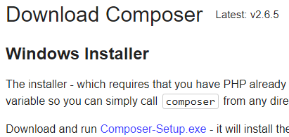<br>

    3. Setelah terdownload, kita bisa langsung menekan "Open file" pada menu download pada browser kita

        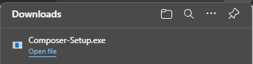<br>

        atau kita juga bisa membuka folder download pada file explorer kita lalu kita mengklik 2 kali filenya.

        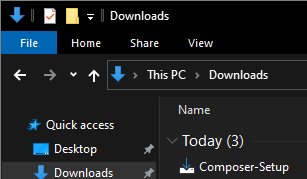<br>

    4. Lalu di sini kita pilih yang "Install for all users".

        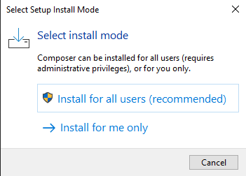<br>

    5. Setelah itu kita tekan next, lalu bila `Laragon` atau development server stack lain terinstall dengan baik, maka installer composer akan otomatis mendetek file phpnya, lalu centang "Add this PHP to your path?". Setelah itu tekan next dan tunggu hingga instalasi selesai.

        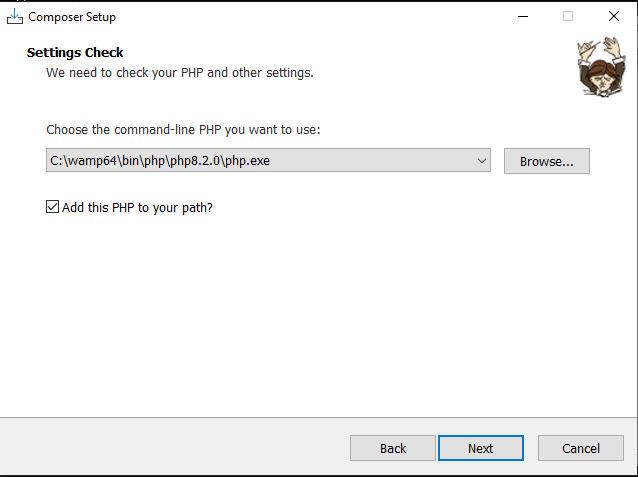<br>

    6. Setelah proses instalasi selesai, kita bisa menekan next dan finish. Dalam beberapa kasus diperlukan restart ataupun re-login setelah instalasi composer dilakukan. Oleh karena itu, amat disarankan untuk melakukan restart perangkat anda sebelum kita beranjak ke tahap konfigurasi.

### Konfigurasi software <hr>

- #### Laragon <hr>

    1. Jalankan `Laragon`, lalu klik kanan dan pilih Tools > Quick add > phpmyadmin.

        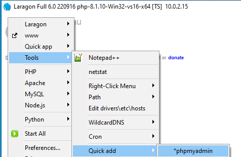<br>

    2. Setelah itu tunggu hingga proses download serta instalasi `phpmyadmin` selesai.

    3. Setelah proses instalasinya selesai, kita tekan "Start All" untuk memulai server.

    4. Lalu buka http://127.0.0.1/phpmyadmin untuk mengecek instalasi `phpmyadmin` kita.

    5. Bila dimintai username dan password, maka isikan saja seperti ini lalu tekan Log in.

        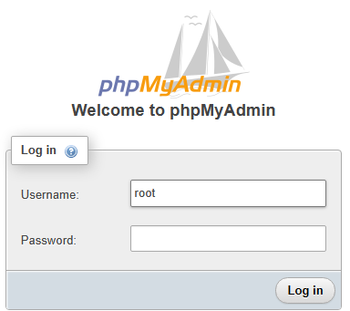<br>

    6. Bila `phpmyadmin` terinstall dengan benar, maka tampilannya akan seperti ini.

        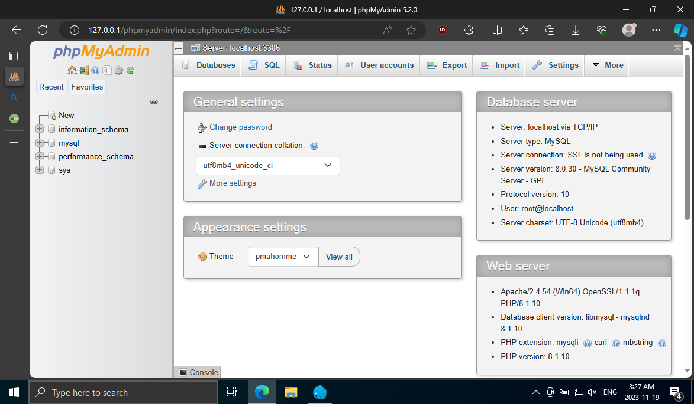<br>

- #### VSCode <hr>

    - ##### Instalasi extension <hr>

        1. Buka `VSCode`, lalu kita buka menu extension pada navigation bar di sebelah kiri atau kita juga bisa menekan kombinasi tombol `Ctrl`+`Shift`+`X` .

             <br>

        2. Lalu kita akan menginstall extension-extension berikut ini,

            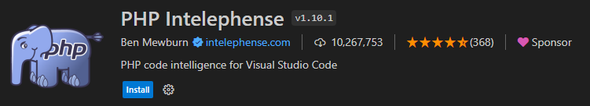<br>
            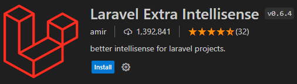<br>
            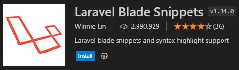<br>
            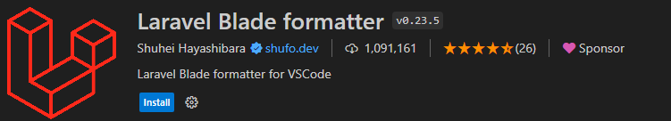<br>

        3. Setelah berhasil terinstall, pastikan semua extension di atas aktif atau enabled.

    - #### Config <hr>

        1. Tekan kombinasi tombol `Ctrl`+`Shift`+`P`, ketikkan "open user settings" lalu pilih yang JSON.

            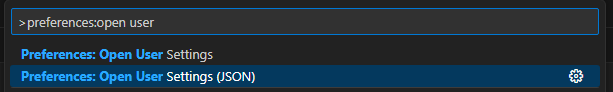<br>

        2. Lalu copy kode berikut ini dan timpa isi dari `settings.json` yang sudah kita buka sebelumnya.

            ```json
            {
                "terminal.integrated.defaultProfile.windows": "Git Bash"
            }
            ```
        3. Dan save lalu anda bisa mengeceknya dengan menekan kombinasi tombol `Ctrl`+`. Bila berhasil maka akan tampil seperti ini.

            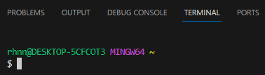<br>

### Closing <hr>

Selamat kita sudah menyelesaikan part ini yang artinya kita sudah siap menuju part berikutnya yang akan membahas instalasi project kita. Sampai jumpa di part selanjutnya.

